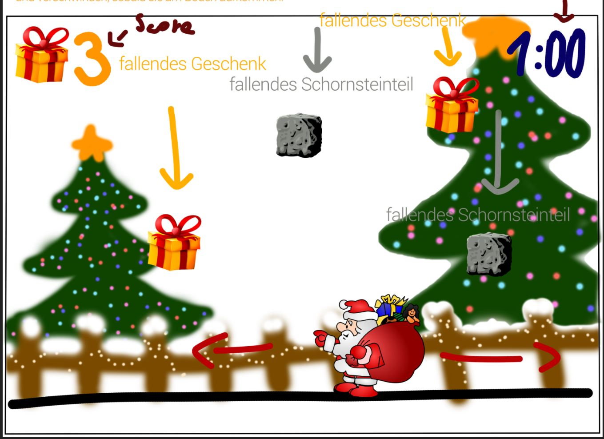
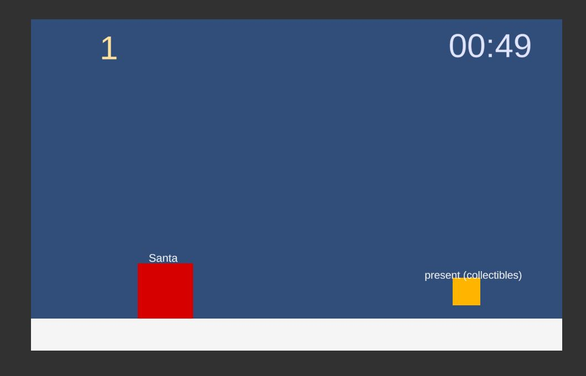

# Ungeschickter Weihnachtsmann

### Project description: 
Short Christmasgame to improve skills in Unity and C#. Collect "presents" and avoid falling "bricks". Santa is bad at navigating (maybe because Rudolph has his free day) and hits a chimney. Now he has to collect all the presents he lost and avoid all the bricks falling from the hit chimney. If they touch him he can't move for two seconds.

### Development platform: 
Windows 10, Unity Version 2020.1.5f1, Visual Studio 2019

### Target platform: 
WebGL Ref.Res. (960x600)

### Visuals:

### Third party material: 

### Project state: 
MVP: done

### Limitations: 

### Lessons Learned: 
<ul>
  <li>Player movement horizontal </li>
  <li>Timer (functionality & display) </li>
  <li>Score (counter & display) </li>
  <li>Trigger Events </li>
  <li>Spawn enemies and collectibles </li>
 </ul>

Copyright by Pia Lacher 
